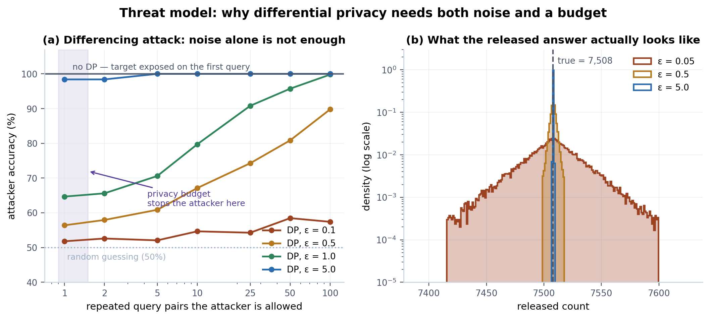
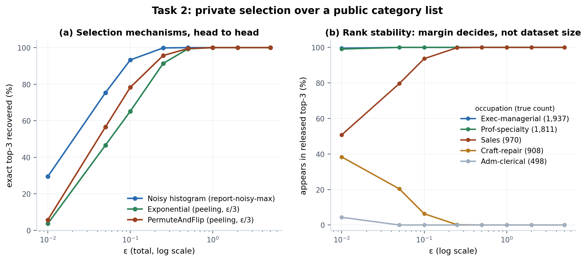
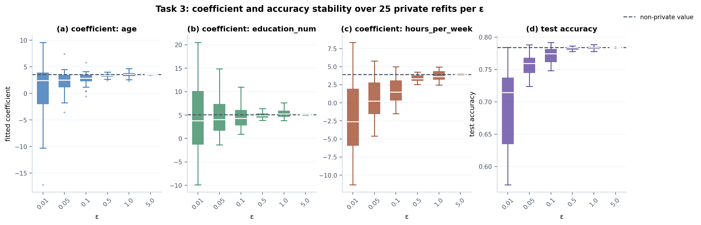
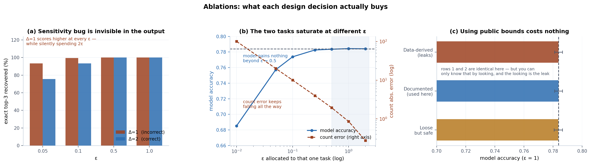

# Differentially Private Analysis of the Adult Dataset — Results

An empirical study of three differentially private releases over the UCI Adult dataset
(n = 30,162): a **count**, a **top-3 selection**, and a **logistic regression model**. Beyond
implementing them, this studies *what each design decision actually costs* — including one
ablation that contradicted my own prediction.

All mechanisms come from IBM **diffprivlib 0.6.6**. No privacy mechanism is hand-implemented.
Every number below is measured, not quoted: 1,200–3,000 trials for the sampling experiments and
25 private refits per ε for the model.

**Ground truth:** 7,508 individuals earn > \$50K. True top-3 occupations: Exec-managerial (1,937),
Prof-specialty (1,811), Sales (970). Non-private logistic regression: accuracy 0.7839,
precision 0.6464, recall 0.3261.

---

## 1 · Threat model — noise alone is not sufficient



The **differencing attack**: an adversary asks two aggregate queries that differ by one
individual and subtracts them. A gap of 1 identifies that person's income. Neither query mentions
the target. Panel (a) plots attacker accuracy against how many repeated query pairs they are
permitted; 50% is chance.

**Attacker accuracy (%) — 1,500 trials per cell**

| ε | 1 pair | 2 | 5 | 10 | 25 | 50 | 100 |
|---|---|---|---|---|---|---|---|
| **0.1** | 51.8 | 52.6 | 52.1 | 54.7 | 54.3 | 58.5 | 57.4 |
| **0.5** | 56.4 | 57.9 | 60.9 | 67.1 | 74.3 | 80.9 | 89.8 |
| **1.0** | 64.7 | 65.6 | 70.6 | 79.7 | 90.8 | 95.7 | **99.8** |
| **5.0** | **98.4** | 98.4 | 100 | 100 | 100 | 100 | 100 |
| *no DP* | **100** | 100 | 100 | 100 | 100 | 100 | 100 |

**Findings**

1. **Without DP the target is exposed on the very first query** — no repetition required.
2. **At ε = 1, noise alone is not enough.** A single query pair leaks meaningfully (64.7% vs 50%
   chance), and 100 repetitions give the attacker near-certainty (99.8%). *The noise is defeated by
   averaging.* This is the empirical justification for a privacy budget: with ε = 3 total the
   attacker is cut off after ~1 repetition, in the shaded region where accuracy is still ~65%.
3. **At ε = 5 the mechanism is close to useless** — 98.4% on the first query.
4. **At ε = 0.1 the attack never gets going**, staying near chance (57%) even after 100 repeats.

Panel (b) shows the released-count distribution on a log density axis. The triangular profile is
the signature of exponentially-decaying Laplace/geometric tails; at ε = 0.05 the release ranges
over ±100 individuals, at ε = 5 it is effectively a spike on the true value.

> **Takeaway:** differential privacy requires *both* calibrated noise *and* enforced composition.
> Noise defeats the single query; only the budget defeats the repeated one.

---

## 2 · Task 2 — private selection over a public category list



Top-3 selection cannot be solved by adding noise to the output — the output is a list of names.
Three mechanisms were compared at matched total ε, 1,200 trials each.

**Exact top-3 recovery rate (%)**

| ε | Noisy histogram<br>(report-noisy-max) | Exponential<br>(peeling, ε/3) | PermuteAndFlip<br>(peeling, ε/3) |
|---|---|---|---|
| 0.01 | **29.4** | 3.7 | 5.7 |
| 0.05 | **75.3** | 46.6 | 56.6 |
| 0.10 | **93.3** | 65.2 | 78.3 |
| 0.25 | **99.8** | 91.3 | 95.7 |
| 0.50 | **100.0** | 99.3 | 99.5 |
| 1.00 | 100.0 | 100.0 | 100.0 |
| ≥ 2.00 | 100.0 | 100.0 | 100.0 |

**Findings**

1. **The noisy histogram dominates at every ε below 1.0**, decisively so in the low-budget regime
   (93.3% vs 65.2% at ε = 0.1). The comparison was deliberately set up to *favour* the
   alternatives: the exponential mechanism and PermuteAndFlip were given sensitivity Δu = 1, since
   their sensitivity is per-candidate, whereas the histogram carries an L1 sensitivity of 2 across
   the whole vector. Even with that handicap the histogram wins, because **parallel composition
   lets it spend ε once across all 14 disjoint buckets, while peeling must split ε three ways.**
2. **PermuteAndFlip consistently beats the exponential mechanism** (78.3% vs 65.2% at ε = 0.1),
   matching the theoretical result of McKenna & Sheldon (2020) that it dominates the exponential
   mechanism for selection.
3. **Above ε = 1 the choice is irrelevant** — all three are exact. Mechanism selection only matters
   in the tight-budget regime.

Panel (b) explains *why* selection is robust here. The probability an occupation appears in the
released top-3 is governed by its **margin**, not by dataset size: Exec-managerial and
Prof-specialty are pinned at 100% across the whole range, while **Sales (970) and Craft-repair
(908) — separated by only 62 individuals — trade third place** until ε ≈ 0.25. Every failure in
the table above is that one swap.

> **Takeaway:** for DP selection, accuracy is decided by the margin between candidates. A million
> rows will not save a near-tie.

---

## 3 · Task 3 — model stability under objective perturbation



25 independent private refits per ε, dashed line = non-private value.

| ε | accuracy (mean) | accuracy (sd) | sd(age) | sd(education) | sd(hours) |
|---|---|---|---|---|---|
| 0.01 | 0.6945 | 0.0630 | 5.88 | 7.01 | 5.24 |
| 0.05 | 0.7575 | 0.0176 | 2.30 | 3.62 | 2.82 |
| 0.10 | 0.7716 | 0.0123 | 1.35 | 2.25 | 1.76 |
| 0.50 | 0.7826 | 0.0025 | 0.35 | 0.58 | 0.49 |
| 1.00 | 0.7835 | 0.0027 | 0.52 | 0.87 | 0.72 |
| 5.00 | 0.7840 | 0.0001 | 0.02 | 0.04 | 0.03 |
| *non-private* | 0.7839 | — | — | — | — |

**Findings**

1. **Mean accuracy badly understates the damage at low ε.** At ε = 0.01 the mean is 0.6945, but the
   standard deviation is 0.063 — a single run can land anywhere from 0.57 to 0.79. The model is not
   merely worse, it is *unreliable*, and reporting one run would be meaningless.
2. **Coefficients degrade far faster than accuracy.** At ε = 0.01 the fitted coefficients span
   roughly −17 to +20 and the median `hours_per_week` coefficient is **negative** — the model has
   learned the opposite of the true relationship while still scoring 0.69 accuracy, because the
   majority class is 75%. **Accuracy hides sign errors.**
3. **By ε = 0.5 the model is indistinguishable from non-private** (0.7826 vs 0.7839) with tight
   coefficient spread.
4. *Caveat:* coefficient sd at ε = 0.5 is slightly below ε = 1.0, which is non-monotonic and almost
   certainly sampling noise at 25 refits rather than a real effect. It is reported as measured.

---

## 4 · Ablations



### 4.1 Sensitivity misspecification — a bug the output cannot reveal

The occupation histogram has L1 sensitivity **2** under bounded DP (one replaced individual
decrements one bucket and increments another). Using **1** is a natural mistake.

| ε | Δ=1 (incorrect) | Δ=2 (correct) | ε claimed | ε actually spent |
|---|---|---|---|---|
| 0.05 | **93.3%** | 75.6% | 0.05 | **0.10** |
| 0.10 | **99.5%** | 93.3% | 0.10 | **0.20** |
| 0.50 | 100% | 100% | 0.50 | **1.00** |
| 1.00 | 100% | 100% | 1.00 | **2.00** |

**The incorrect setting produces strictly better-looking results at every ε.** There is no test on
the output that detects it — the released top-3 is simply *more* accurate — while the actual
privacy expenditure is double what is claimed and recorded.

A self-check confirms the ablation measures what it claims: **Δ=1 at ε=0.05 and Δ=2 at ε=0.10 both
score 93.3%**, because both yield noise scale Δ/ε = 20. Understating sensitivity is arithmetically
identical to doubling ε.

> This is the failure mode that makes DP dangerous in practice: the bug improves your metrics.

### 4.2 Budget allocation — a prediction that turned out wrong

I expected a utility-aware split (starve the cheap count, feed the expensive model) to beat equal
splitting. **It does not.**

| Strategy | total ε | count / top-3 / model | count abs. err | top-3 exact | model acc |
|---|---|---|---|---|---|
| Equal split | 3.0 | 1.0 / 1.0 / 1.0 | **0.88** | 100% | 0.7837 |
| Utility-aware | 3.0 | 0.1 / 0.4 / 2.5 | 10.19 | 100% | 0.7841 |
| Utility-aware, half | 1.5 | 0.05 / 0.2 / 1.25 | 20.41 | 99.9% | 0.7838 |
| Minimal | 0.5 | 0.05 / 0.1 / 0.35 | 20.41 | 93.8% | 0.7829 |

Utility as a function of the ε given to a single task:

| ε | model accuracy | count abs. error |
|---|---|---|
| 0.01 | 0.6852 | 100.6 |
| 0.05 | 0.7573 | 20.1 |
| 0.10 | 0.7738 | 10.1 |
| 0.25 | 0.7826 | 4.0 |
| 0.50 | 0.7836 | 1.9 |
| 1.00 | 0.7844 | 0.9 |
| 2.00 | 0.7841 | 0.3 |

**The model saturates at ε ≈ 0.25–0.5 and gains nothing thereafter; the count improves
monotonically across the entire range.** So the direction of my hypothesis was backwards — the
model is the task that should be *starved*, not fed, and the surplus belongs to the count.

**Implied better allocation:** count 0.7 / top-3 0.3 / model 0.5 = **total ε = 1.5** — half the
privacy cost of the equal split, with comparable count error (~1.2), 100% top-3, and model accuracy
within noise of 0.7839.

### 4.3 The cost of refusing to look at the data

`data_norm` and the feature ranges must come from public metadata, never from the data. What does
that discipline cost?

| Bounds | Specification | accuracy (ε=1) | leaks? |
|---|---|---|---|
| Data-derived | age (17, 90), educ (1, 16), hours (1, 99) | 0.7838 ± 0.0026 | **yes** |
| Documented *(used here)* | age (17, 90), educ (1, 16), hours (1, 99) | 0.7838 ± 0.0026 | no |
| Loose but safe | age (0, 120), educ (0, 20), hours (0, 168) | 0.7836 ± 0.0029 | no |

**Correctness is free.** The documented bounds happen to coincide exactly with the data range, so
utility is identical — but *you cannot know they coincide without computing a min and max over
private records*, which is precisely the leak. Even a deliberately loose bound (age 0–120, hours
0–168) costs only 0.0002 accuracy, well inside run-to-run noise.

> The privacy-preserving choice cost nothing measurable. There was no trade-off to make.

---

## Summary of findings

| # | Finding |
|---|---|
| 1 | Noise alone is insufficient: at ε = 1, 100 repeated queries expose the target with 99.8% accuracy. Enforced composition is load-bearing, not bookkeeping. |
| 2 | The noisy histogram beats both the exponential mechanism and PermuteAndFlip for top-k at ε < 1, even when handicapped — parallel composition beats budget splitting. |
| 3 | PermuteAndFlip dominates the exponential mechanism, as theory predicts. |
| 4 | Selection accuracy is set by candidate margin, not dataset size. Every observed failure was one 62-count gap. |
| 5 | Understating sensitivity *improves* measured utility while silently doubling ε — undetectable from the output. |
| 6 | Model utility saturates at ε ≈ 0.5; count utility never does. Equal budget splitting therefore overpays the model. My initial hypothesis was the wrong way round. |
| 7 | Accuracy hides coefficient sign errors: at ε = 0.01 the model learns a negative `hours_per_week` effect while scoring 0.69. |
| 8 | Sourcing bounds from public metadata rather than the data costs nothing measurable. |

## Reproducing

```bash
pip install "diffprivlib>=0.6" pandas scikit-learn matplotlib
python make_figures.py
```

Reads `adult_clean.csv` if present, otherwise rebuilds it from the UCI archive (verified
row-identical). Writes all four figures as PNG and PDF to `figures/`. Runtime ~3 minutes.

## References

- Dwork & Roth (2014), *The Algorithmic Foundations of Differential Privacy*
- Chaudhuri, Monteleoni & Sarwate (2011), *Differentially Private Empirical Risk Minimization*, JMLR 12 — objective perturbation
- McKenna & Sheldon (2020), *Permute-and-Flip: A new mechanism for differentially private selection*, NeurIPS
- McSherry & Talwar (2007), *Mechanism Design via Differential Privacy* — exponential mechanism
- Holohan et al. (2019), *Diffprivlib: The IBM Differential Privacy Library*
