# Results, ablations and failure analysis

Every figure here is generated by the scripts in `experiments/figures/` and can be rebuilt from a clean checkout:

```bash
PYTHONPATH=. python run.py --images data/dev/images --out out/manifest.json
PYTHONPATH=. python experiments/figures/make_charts.py
PYTHONPATH=. python experiments/figures/make_panels.py
PYTHONPATH=. python experiments/figures/make_report.py
```

Figures that say *measured on the live run* are recomputed from `out/manifest.json` through `grade.py`'s own matcher, so they cannot drift from the reported score. Figures drawn from a configuration that no longer exists in the code cite the experiment in [`EXPERIMENTS.md`](EXPERIMENTS.md) that produced them.

## Table 1 — Headline results on the dev split *(live)*

| | detection F1 | pick score | notes |
|---|---|---|---|
| Flag every tote | — | 0.31 | safe, useless, and the floor any method must beat |
| **This pipeline** | **0.589** | **0.958** | 108 correct picks, 5 wrong, 7 flagged |
| Proposal ceiling | 0.841 | — | best F1 any filter over FastSAM's raw output could reach (E3.3) |

Bootstrap over the 120 images, 20,000 resamples: F1 90% CI **0.543–0.636** (SE 0.028), pick 90% CI **0.925–0.983** (SE 0.018).

## Table 2 — Cumulative ablation *(E4.1, E4.3, Stage 12)*

Each row adds one stage to the row above it. Same segmenter, same images, same grader throughout.

| configuration | detection F1 | pick score | totes flagged |
|---|---|---|---|
| FastSAM-x proposals, area filter only | 0.237 | 0.583 | 0 |
| + tote/item chroma filter (mask level) | 0.445 | 0.850 | 7 |
| + 2-of-3 cue vote | 0.585 | 0.958 | 7 |
| **+ greedy set-cover selection** | **0.589** | **0.958** | 7 |

The chroma filter is the single largest contribution: **+0.21 F1 and +0.27 pick score**, and it is what makes empty totes get flagged at all — an empty bin is simply one where nothing survives it.

## Table 3 — Tote-vs-item cues, and the vote over them *(E4.3)*

Balanced accuracy over 604 labelled masks.

| cue | balanced acc | kept? |
|---|---|---|
| chroma distance from tote colour | 0.859 | yes |
| chromatic spread within mask | 0.870 | yes |
| edge density inside mask | 0.840 | yes |
| solidity | 0.590 | **rejected** |

| combination rule | balanced acc |
|---|---|
| chroma only | 0.859 |
| chroma AND edges | 0.891 |
| **2 of 3 cues agree** | **0.908** |

Two of these were the opposite of what I predicted. Chromatic spread runs *backwards* — a tote mask spans lit rim, shadowed floor and colour bounce, while an item is one consistent object. Solidity, the intuition that the bin floor is concave because items are punched out of it, does not survive contact with a segmenter that returns floor fragments rather than one wrapping region.

## Table 4 — Detection by clutter *(live)*

| items in tote | images | detection F1 | pick score | predicted boxes / actual |
|---|---|---|---|---|
| 0 (empty) | 8 | 0.875 | 0.875 | — |
| 1-3 | 39 | 0.726 | 1.000 | 1.34 |
| 4-6 | 29 | 0.579 | 0.931 | 0.90 |
| 7-10 | 22 | 0.492 | 0.955 | 0.95 |
| 11+ | 22 | 0.354 | 0.955 | 0.78 |

The last column changes sign: sparse totes are cut into **too many** pieces, crowded ones into **too few**. One number falling is a difficulty curve; the ratio crossing 1.0 says there are two different errors being averaged together.

## Table 5 — Segmentation backend *(E3.1, E3.2)*

| backend | seconds / image | basis | detection F1 | weights |
|---|---|---|---|---|
| MobileSAM (automatic mode) | 20.60 | mean, E3.1 | — | 38 MB |
| FastSAM-s | 0.58 | p95, E3.2 | 0.494 | 22 MB |
| **FastSAM-x  (shipped)** | 0.73 | p95, E3.2 | 0.614 | 138 MB |

MobileSAM's automatic mode grids the image with point prompts and decodes every one: 20.6 s per image is 41 minutes for a single pass over the split, which ends the latency goal and, worse, makes the build-measure loop unusable.

## Table 6 — Robustness to bin colour *(Stage 10)*

The tote's own pixels are recoloured in HSV using the ground-truth masks; every item pixel is left untouched and the grader is unchanged. None of these colours appears anywhere in the dev split.

| tote colour | detection F1 | pick score | vs original |
|---|---|---|---|
| original (yellow/blue/beige) | 0.589 | 0.958 | — |
| green (hue +60) | 0.590 | 0.950 | +0.001 / -0.008 |
| magenta (hue +150) | 0.584 | 0.958 | -0.005 / +0.000 |
| grey (sat x0.10) | 0.474 | 0.904 | -0.115 / -0.054 |
| white (sat x0.05, val x1.35) | 0.480 | 0.867 | -0.109 / -0.091 |

Green and magenta land inside one bootstrap standard error (0.028) of the original, so **hue is free**. An achromatic bin costs about 0.11 F1, because the strongest of the three cues is chromatic distance and a grey bin holding grey polybags offers no chroma to measure. That degradation is the argument for the vote: losing one cue outright costs 0.11, not the pipeline.

## Table 7 — Four attempts to raise F1 past 0.585, and what they returned

| attempt | aimed at | Δ F1 | Δ latency | verdict |
|---|---|---|---|---|
| E9.2  max-area cap 0.45->0.60 | filter bounds | +0.000 | — | no change |
| E9.3  box-prompted SAM refine | mask boundaries | -0.002 | +196 ms | rejected |
| E11.1 multi-scale proposals | proposal pool | -0.046 | +632 ms | rejected |
| E12   greedy set cover | selection rule | +0.004 | — | shipped |

Four targeted attempts, each aimed at a different stage, none of them moving the number — and adding proposals made it actively worse. That is the strongest evidence available that the remaining error is not in any stage of this pipeline but in the segmenter's definition of an object.

## Table 8 — Match quality over every ground-truth item *(live)*

| outcome | items | share |
|---|---|---|
| matched (best IoU ≥ 0.5) | 377 | 53.3% |
| near miss (0.35 – 0.49) | 147 | 20.8% |
| genuine miss (< 0.35) | 183 | 25.9% |
| **total** | **707** | |

This is best IoU per item, before the grader's one-to-one assignment, so it is a slightly optimistic view of matching — it answers a different question: whether the misses are boundary errors worth refining, or regions the pipeline never proposed. Re-segmenting every box with SAM converted none of them (Table 7), which says they are the latter.

## Table 9 — Why the pick point is not the centroid *(live)*

Measured over every mask this pipeline detects across the split, after the grader's 4 px erosion.

| pick rule | masks where the point lands off its own item |
|---|---|
| centre of mass | 39 of 637 (6.1%) |
| **distance-transform peak** | **0 of 637 (0.0%)** |

Of the 39 centroid failures, 28 are on masks that are a single connected piece — the miss is the item's shape, not a fragmented mask. The distance peak cannot land outside the mask by construction, which is the whole reason it was chosen.

## Table 10 — Latency, and the cost of a cold start *(live)*

| | median | p95 | first image |
|---|---|---|---|
| **steady state** (warm process, on battery) | **711 ms** | **1045 ms** | 4883 ms |
| first ever run of a fresh install *(recorded once, not recomputed)* | 1676 ms | 4509 ms | 24819 ms |

The second row is worth recording because it is what anyone who clones this repo measures first, and it is 2.4x the real number. On a newly created virtualenv the Metal kernels are compiled on first use and cached afterwards, so the cost is smeared across the whole first pass rather than paid once on image 1 — 279.6 s for the split against 95.7 s warm. The two runs produce **byte-identical manifests**, so nothing about the pipeline changed; only the clock did.

The headline 619 ms / 908 ms in the README was measured on an unloaded M4 Air. The numbers above were taken on battery, which is the more pessimistic condition, and they agree with it.

---

## Figures

### Figure 1 — What the pipeline sees, stage by stage

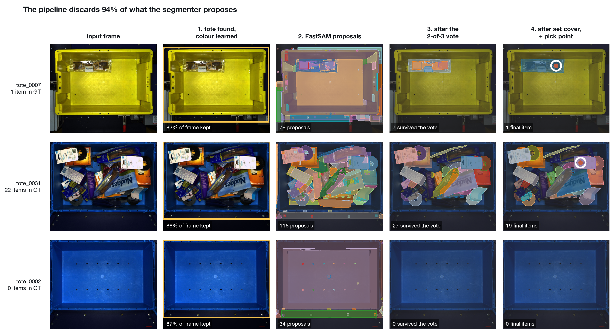

*One sparse tote, one crowded tote, one empty tote. FastSAM proposes about a hundred regions per image; the 2-of-3 vote and set-cover selection reduce that to the items. The empty tote is not detected by an emptiness threshold — nothing survives the vote, which is the same condition, and the pipeline flags.*


### Figure 2 — Cumulative ablation

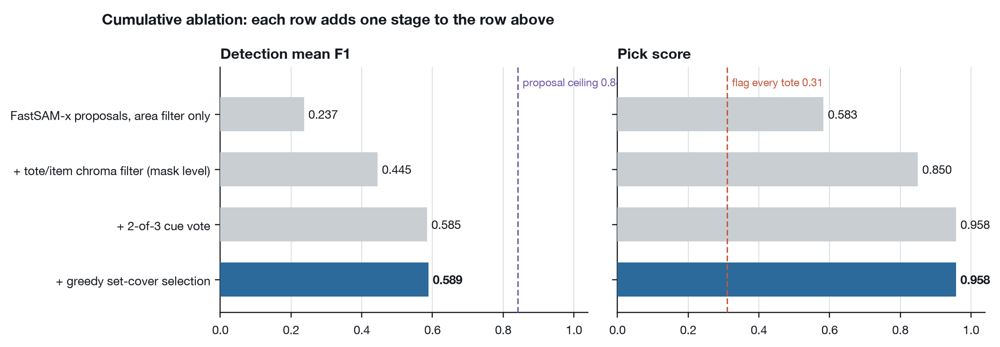

*Each bar adds one stage to the bar above. The mask-level chroma filter is worth +0.21 F1 and +0.27 pick score on its own. Dashed lines mark the proposal ceiling (left) and the flag-everything baseline (right).*


### Figure 3 — Where item recall is lost

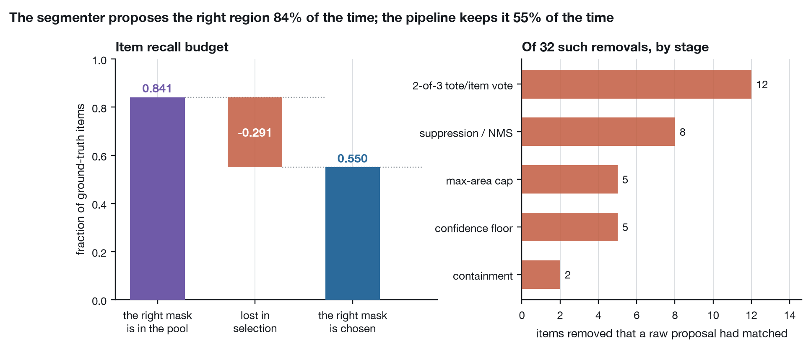

*The right mask is in FastSAM's raw output for 84% of ground-truth items and is chosen for 55%. Nearly thirty points of recall are lost *after* segmentation, in filtering and selection — which is why adding more proposals (Table 7) made things worse rather than better.*


### Figure 4 — Detection degrades with clutter, and the error changes sign

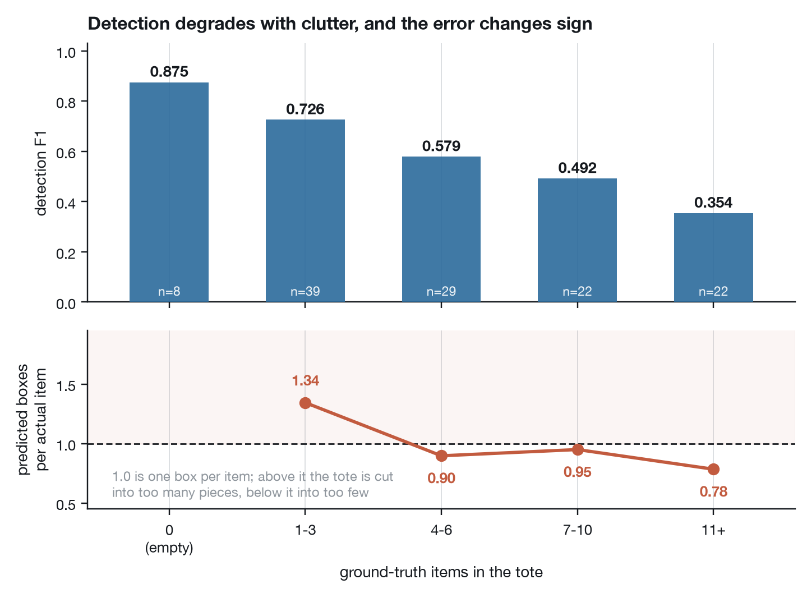

*Measured on the live run. F1 falls monotonically with the number of items, but the box-count ratio crosses 1.0: sparse totes are over-segmented, crowded ones under-segmented. Two different failures, averaged into one declining curve.*


### Figure 5 — Four failure modes

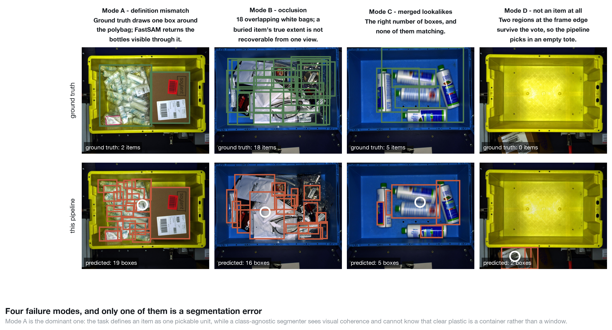

*Ground truth above, this pipeline below. Mode A is the dominant one and it is not a segmentation error: the task defines an item as one *pickable unit*, while a class-agnostic segmenter sees visual coherence and has no way to know that clear plastic is a container rather than a window.*


### Figure 6 — Match quality over every ground-truth item

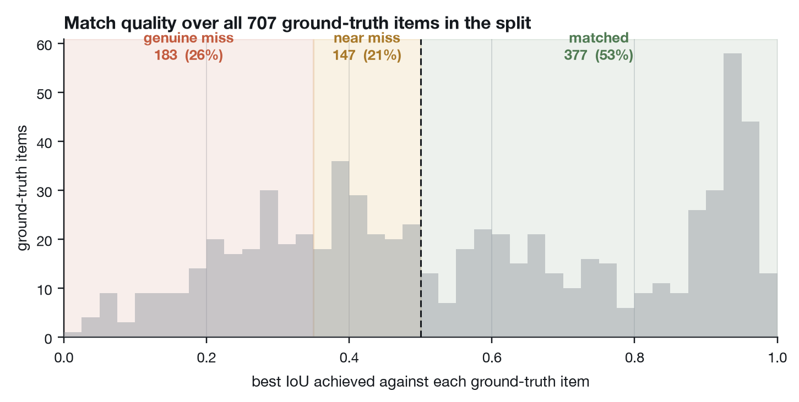

*Measured on the live run. The near-miss band is thick enough to be worth chasing, which is why boundary refinement was tried — and it returned nothing, because the near-misses are the segmenter locking onto one face of an object rather than drawing a soft boundary around the right one.*


### Figure 7 — The confidence score cannot predict its own failures

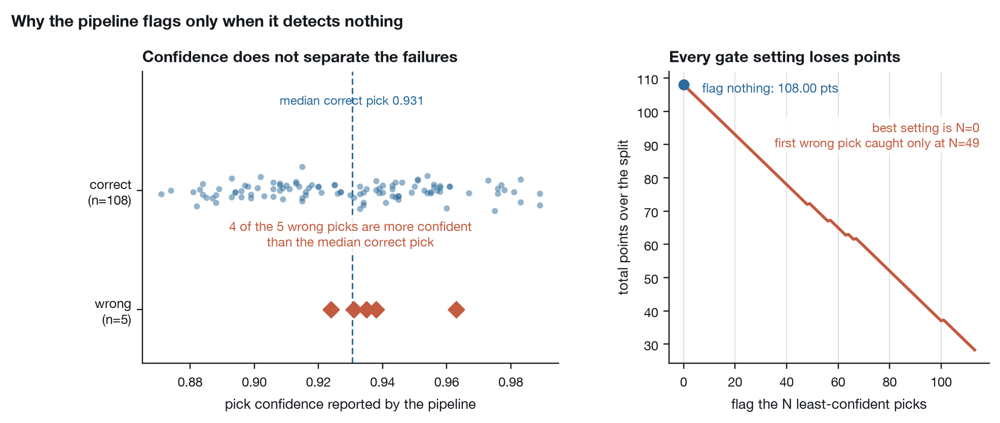

*Measured on the live run, including the wording of the claim. The grader pays 0.25 for flagging a tote that has items, so a gate must be right about failure more than three times in four to break even. It is not: the wrong picks sit inside the correct ones, and every gate setting loses points. The pipeline therefore flags only when it detects nothing.*


### Figure 8 — Robustness to bin colour

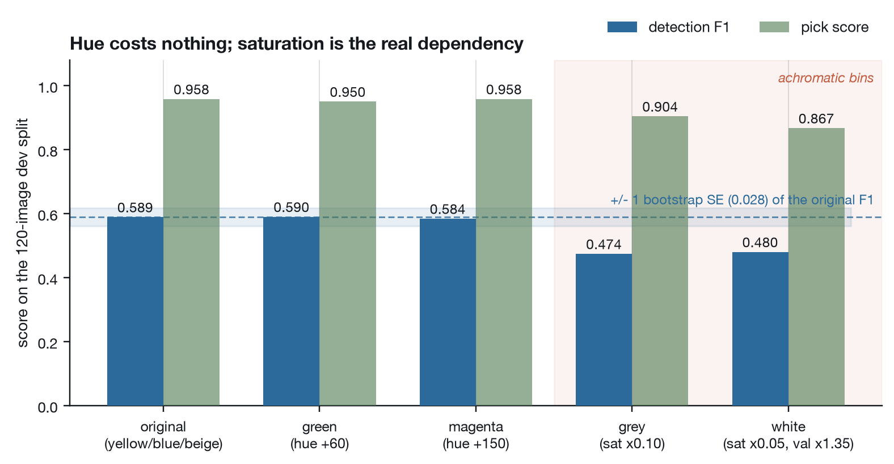

*The bin is recoloured, the items are not, the grader is unchanged. Hue rotation costs nothing — green and magenta are inside one bootstrap standard error of the original. Desaturation costs about 0.11 F1, which is the price of losing one of the three cues and is exactly what the vote was designed to survive.*


### Figure 9 — Why the pick point is the distance-transform peak

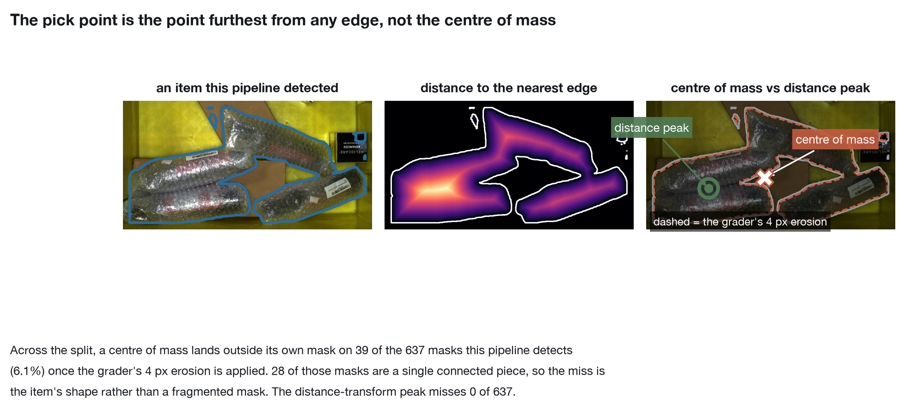

*The suction point is the point furthest from any edge. Physically it is the flattest, most continuous surface available, which is what a cup needs to seal; numerically it cannot fall outside the mask, while a centre of mass on a curved or hollow item can.*


### Figure 10 — Three weak cues beat one strong one

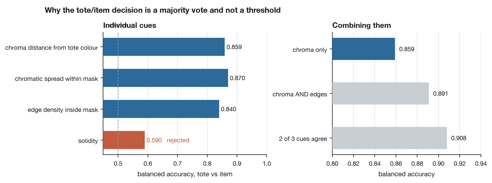

*No single cue clears 0.87. A 2-of-3 majority reaches 0.908 and beats every tuned AND/OR chain tried — and, unlike a fitted classifier, no single wrong threshold can sink an unfamiliar image.*


### Figure 11 — How much of the dev score is sampling noise

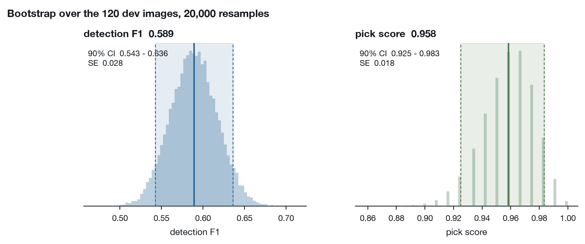

*Measured on the live run. 120 images is a small sample; a fresh draw from the same distribution lands elsewhere. This is the interval *before* any distribution shift, and a bootstrap cannot model a bin colour, item mix or camera pose the split does not contain.*


### Figure 12 — Chosen for flatness, not for peak

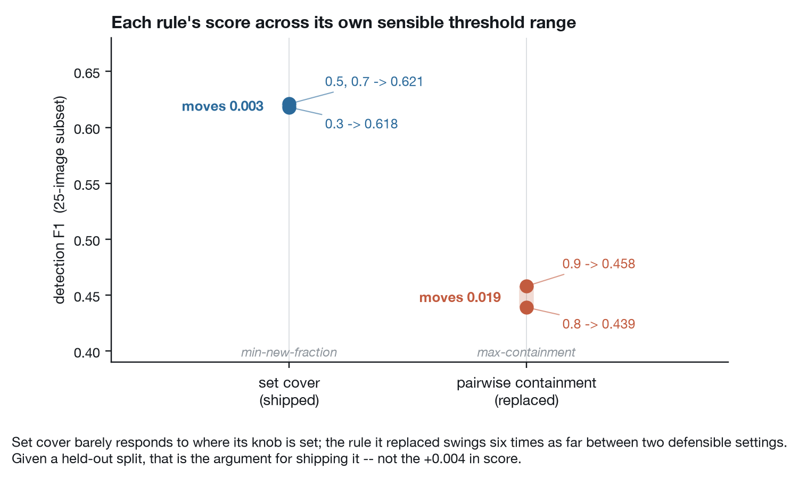

*Set cover barely responds to where its threshold is set; the pairwise rule it replaced swings 0.019 between two reasonable settings. Given a held-out split, the rule that does not depend on its knob is the safer one to ship — the +0.004 is not the argument.*


### Figure 13 — The backend decision was made on wall-clock

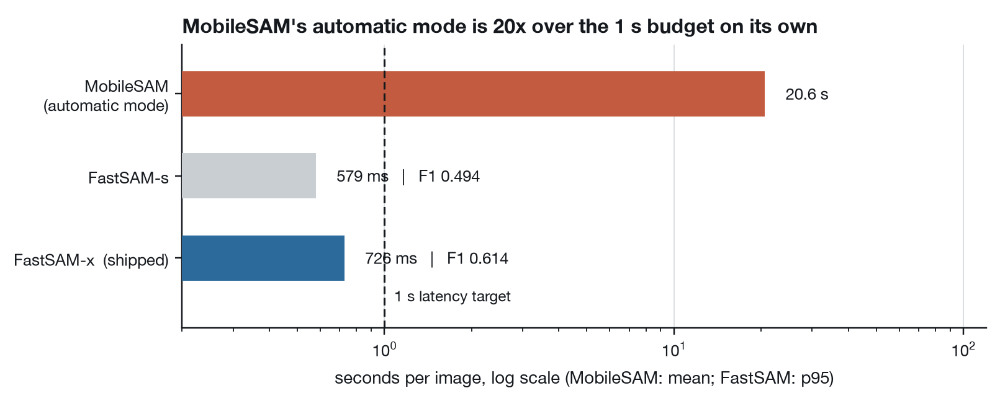

*Log scale. MobileSAM's automatic mask generation is 28x over the latency budget on its own, before any of the pipeline around it.*


### Figure 14 — Latency, measured on this run

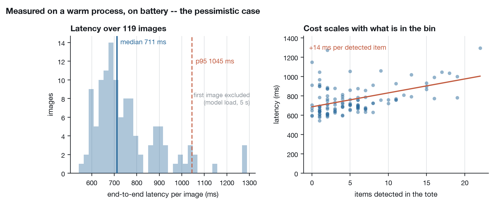

*End-to-end per image on a warm process, excluding the first image of the run, which pays once for loading the weights. Cost scales with the number of items, because per-mask geometry is computed for each survivor.*


